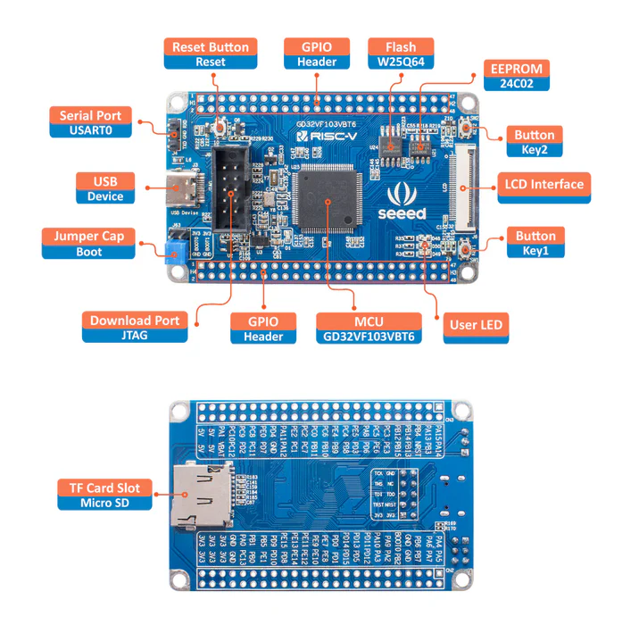

# RISC-V F/W 開発
RISC-V F/W 開発 by Chiim(ちみ)🥳

## ✅実装した機能

- ✅OS (FreeRTOS)
  - ✅メインタスク
    - ✅LEDアプリ : システムの状態に応じて色表示
      - ✅LED0 (PB5) : TODO
      - ✅LED1 (PB0) : TODO
      - ✅LED2 (PB1) : TODO
- ✅割込み
  - ✅ボタンIRQ(PA0、PC13)
    - `ボタン単押し`:ボタン一回押しを検知
    - `ボタン複数押し`:短時間に複数回ボタン押しを検知
    - `ボタン長押し`:ボタン長押しを検知（1000ms = 1s）
    - `ボタン超長押し`:ボタン長押しを検知（3000ms = 2s）

## 🤖開発基板
[SeeedStudio GD32 RISC-V Dev Board]

https://wiki.seeedstudio.com/SeeedStudio-GD32-RISC-V-Dev-Board/

- マイコン : GD32VF103VBT6
  - CPU : RISC-V (RV32IMAC)
  - ROM : 128 KB
  - RAM : 32 KB
  - GPIO : x80本
  - UART : x5ch
  - SPI : x3ch
  - I2C : x2ch
  - I2S : x2ch
  - CAN : x2ch
  - ADC : x10ch
  - DAC : x2ch
  - タイマー
    - 16bit高機能 : x1ch
    - 16bit汎用 : x4ch
    - 16bit基本 : x2ch
  - RTC
  - WDT
  - Systick
  - USB FS/OTG x1

- 実装部品
  - NOR Flash : 8 MB (W25Q64)
  - EEOROM : 256 Byte (AT24C02)
  - ボタン : x2 (PA0、PC13)
  - LED(青) : x3 (PB5、PB0、PB1)
  - SDスロット
  - LCD IF : 8080 16bit (SPI)

<!--  -->